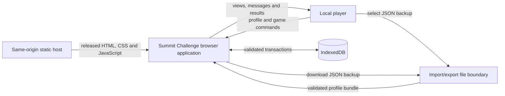
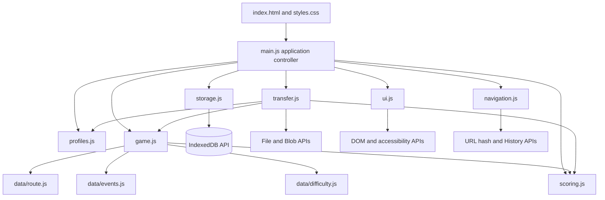
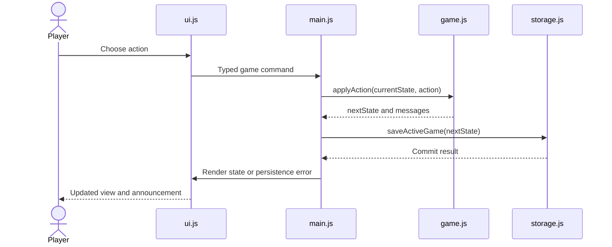
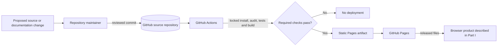

# Summit Challenge — Project Design Overview, Version 2

## Document status

This document describes the intended architecture for Summit Challenge Version 3. It complements the [current implementation specification](specifications/summit-challenge-specification-v3.md); if the documents conflict, the specification is authoritative.

Version 2 separates two related but distinct subjects:

1. **Product runtime design** describes the game that runs in a player's browser: its behavior, modules, data, storage and runtime boundaries.
2. **Development and delivery design** describes how people and automation create, verify and publish the product: source control, tests, dependency management, GitHub Actions and GitHub Pages.

A development responsibility is not a product feature. In particular, the repository maintainer is not an application actor, module, privileged user or runtime administrator.

---

# Part I — Product Runtime Design

## 1. Product overview

Summit Challenge is a static, local-only browser game. A player attempts to reach a fictional mountain summit and return safely while managing route choices, energy, hydration, daylight, supplies, equipment and deterministic weather events.

The application has no backend, authentication, cookies, analytics or external runtime API. Profiles, active games and results live in IndexedDB in the player's browser. A player may manually back up or transfer one profile through a validated JSON file.

The runtime product does not include repository maintenance, source review, dependency updates, build automation or deployment controls. Those concerns are described in Part II.

## 2. Runtime design goals

- Keep game and scoring rules deterministic and independent of browser APIs.
- Keep DOM manipulation, navigation, storage and file handling outside domain logic.
- Permit no more than eight pseudonymous profiles in the current browser database.
- Isolate each profile's active game and results in the supported interface.
- Treat IndexedDB records, URL state and imported files as untrusted input.
- Make state-changing storage operations transactional where practical.
- Preserve a small vanilla-JavaScript application with explicit module boundaries.
- Provide responsive, keyboard-accessible and screen-reader-friendly interactions.
- Make no application-data requests to external origins during normal play.

## 3. Runtime actors and boundaries

| Actor or boundary | Inputs to the product | Outputs received or stored |
|---|---|---|
| Local player | Profile name, difficulty, game actions, confirmations and selected import file | Rendered views, status announcements, game results, local scores and exported JSON file |
| Browser application | Player commands, navigation events, clock values, cryptographic seed values and browser API results | DOM updates, domain calls, storage transactions and file downloads |
| IndexedDB repository | Validated profile, active-game and result records | Stored profiles, one active game per profile and completed histories |
| Import/export boundary | User-selected JSON bytes or a validated export model | Validated transfer model or downloaded UTF-8 JSON backup |
| Same-origin static host | Requests for released HTML, CSS and JavaScript files | Static application files delivered to the browser |

The **IndexedDB repository** is a persistence abstraction inside the running application. It is not the GitHub source repository and it is not an authentication system.

The static host delivers the released application files. After loading, gameplay data remains between the player, browser APIs and local IndexedDB; it is not sent to the host.

## 4. Runtime system context



This diagram describes product operation only. It intentionally excludes maintainers, Git, tests, build tools and deployment automation.

## 5. Application module architecture



Module dependency rules:

1. `main.js` is the composition root and application controller.
2. UI modules emit typed commands; they do not update IndexedDB or game state directly.
3. `storage.js` is the only module that calls IndexedDB.
4. `transfer.js` is the only module that parses imported files or creates downloadable exports.
5. Game, scoring, profile validation and configuration modules do not access the DOM, browser storage or network.
6. Data/configuration modules are immutable dependency leaves and do not import application modules.
7. Modules do not create circular imports.
8. Mutable application state belongs to the controller or IndexedDB, never to module-level globals.

## 6. Product source structure

Only files that become part of the application or directly define its runtime behavior appear here. Repository support files are described in Part II.

```text
index.html
src/
  main.js                 Application bootstrap and command coordination
  navigation.js           Hash routes and browser-history handling
  ui.js                   DOM rendering, event binding and announcements
  profiles.js             Pure local-profile rules and validation
  game.js                 Pure deterministic game state machine
  scoring.js              Pure score calculation and eligibility
  storage.js              IndexedDB repository and transactions
  transfer.js             JSON export/import boundary
  styles.css              Responsive and accessible presentation
  data/
    route.js              Immutable route graph
    events.js             Immutable random-event definitions
    difficulty.js         Immutable difficulty configuration
```

The implementation may split `ui.js` into smaller view modules when it becomes large, provided the views retain the same input/output boundary.

## 7. Runtime data contracts

These examples are conceptual JavaScript object shapes. Runtime validators check data loaded from storage or a file before it enters application state.

### Profile

```js
{
  id: "random UUID",
  displayName: "Alice_1",
  canonicalName: "alice_1",
  createdAt: "ISO-8601 timestamp"
}
```

### Game state

```js
{
  schemaVersion: 1,
  gameId: "random UUID",
  profileId: "profile UUID",
  difficulty: "easy | normal | hard",
  phase: "outbound | returning | terminal",
  currentNodeId: "route node ID",
  selectedSegmentId: "segment ID or null",
  traversedSegmentIds: [],
  returnSegmentIds: [],
  summitReached: false,
  resources: {
    energy: 100,
    hydration: 100,
    daylightMinutes: 480,
    foodRations: 3,
    waterPortions: 3
  },
  equipment: {
    rainJacketAvailable: true,
    firstAidAvailable: true,
    torchMinutesRemaining: 120
  },
  weather: "clear",
  rng: { seed: 0, state: 0 },
  pendingEvent: null,
  statistics: {
    distanceTravelledKm: 0,
    cumulativeAscentM: 0,
    minutesAfterDark: 0,
    actionsTaken: 0
  },
  startedAt: "ISO-8601 timestamp",
  updatedAt: "ISO-8601 timestamp",
  outcome: null,
  messages: []
}
```

The chosen pseudo-random generator must be documented. Its serialisable state must reproduce the same next event after restoration.

### Player command

```js
{ type: "choosePath", segmentId: "segment ID" }
{ type: "continueWalking", confirmTorchUse: true }
{ type: "rest" }
{ type: "drink" }
{ type: "eat" }
{ type: "useEquipment", equipmentId: "firstAid" }
{ type: "turnBack" }
{ type: "abandon" }
```

Navigation, saving, import/export and profile management are application commands handled by `main.js`, not game actions passed to `game.js`.

### Completed result

```js
{
  schemaVersion: 1,
  resultId: "random UUID",
  profileId: "profile UUID",
  gameId: "game UUID",
  difficulty: "easy | normal | hard",
  startedAt: "ISO-8601 timestamp",
  completedAt: "ISO-8601 timestamp",
  outcome: "summitSafe | returnedSafe | rescue | abandoned",
  score: 0,
  scoreBreakdown: {},
  scoringInputs: {},
  statistics: {}
}
```

`scoringInputs` contains the canonical bounded values needed to recompute an imported score. Rescue and abandoned results have a leaderboard score of zero.

### Export envelope

```js
{
  format: "summit-challenge-profile",
  version: 1,
  exportedAt: "ISO-8601 timestamp",
  profile: {},
  activeGame: null,
  results: []
}
```

An imported envelope remains untrusted until `transfer.js` validates and reconstructs every nested record.

## 8. Runtime module responsibilities

| Module | Runtime responsibility | Primary boundary |
|---|---|---|
| `main.js` | Bootstrap the application, serialise commands, coordinate domain calls, persistence and view models, and convert failures into safe user messages | Calls application modules; never calls IndexedDB directly |
| `navigation.js` | Parse allow-listed hash routes and coordinate Back/Forward navigation | History API |
| `ui.js` | Render semantic views, bind input events, manage focus/busy state and announce updates | DOM and accessibility APIs |
| `profiles.js` | Normalise, validate, canonicalise and create pseudonymous local profiles | Pure domain logic |
| `game.js` | Create and validate deterministic game states, apply actions, resolve events and determine outcomes | Pure domain logic and immutable configuration |
| `scoring.js` | Calculate bounded score totals, breakdowns and eligibility | Pure deterministic logic |
| `storage.js` | Read and transactionally write profiles, active games and results | Only IndexedDB caller |
| `transfer.js` | Create exports and parse, reconstruct and validate imports up to 1 MiB | File and Blob APIs; never writes IndexedDB |
| `data/route.js` | Define and validate the immutable route graph | Dependency leaf |
| `data/events.js` | Define stable deterministic event conditions, weights and effects | Dependency leaf |
| `data/difficulty.js` | Define immutable difficulty parameters | Dependency leaf |
| `index.html` and `styles.css` | Provide the document shell, meta CSP and accessible responsive presentation | Browser rendering |

Important behavioral constraints:

- `main.js` saves after every successful state-changing game action and reports when a write is not durable.
- `game.js` never reads the current clock or calls uncontrolled randomness while applying an action.
- `scoring.js` ignores imported totals and recalculates them from validated canonical inputs.
- `ui.js` renders user-provided values with text APIs, never by interpolating them into HTML.
- `transfer.js` allow-lists fields and reconstructs clean objects rather than trusting parsed object prototypes.

## 9. IndexedDB persistence design

| Object store | Key | Important indexes | Value |
|---|---|---|---|
| `profiles` | `id` | Unique `canonicalName`; `createdAt` | `Profile` |
| `activeGames` | `profileId` | `updatedAt` | One validated `GameState` wrapper per profile |
| `results` | `resultId` | Non-unique `profileId`; profile/completion ordering where supported | `CompletedResult` |

```text
Profile (1)
├── Active game (0..1)
└── Completed results (0..many)
```

Required atomic operations:

- Create a profile only when the count is below eight and its canonical name is unique.
- Delete a profile together with its active game and results.
- Add a completed result and remove the corresponding active game.
- Add or replace a complete imported profile bundle without partial writes.

Database upgrades are versioned. An upgrade either migrates records transactionally or leaves the previous database usable. Unsupported or corrupt records produce recovery guidance instead of crashing the application.

## 10. Principal product interactions

### Apply a game action and autosave



### Complete a game

1. `game.js` returns a terminal state with exactly one outcome.
2. `scoring.js` calculates the local score, breakdown and eligibility.
3. `main.js` creates a clean `CompletedResult`.
4. `storage.js` inserts the result and deletes the active game in one transaction.
5. `ui.js` shows a persisted result, or clearly labels an unsaved result and offers retry.

### Export and import a profile

- Export loads and validates the selected profile bundle, creates a versioned JSON envelope and downloads it without uploading data.
- Import parses at most 1 MiB, validates every field, recalculates scores, resolves capacity/name conflicts, requests replacement confirmation when required, and commits the complete clean bundle in one transaction.
- A failed or cancelled import does not change stored data.

## 11. Runtime error, security and privacy boundaries

Expected runtime error categories are validation errors, invalid game actions, corrupt or unsupported records, import failures, storage failures and programming errors. The controller gives safe recovery guidance and never continues with partially updated state.

Runtime security and privacy rules:

- Local profiles are convenience identities, not authenticated accounts.
- Do not collect IP addresses, use cookies or fingerprint devices.
- Do not store personal information, credentials or privileged secrets.
- Make no runtime requests except same-origin requests needed to load static application files.
- Treat IndexedDB, URL state and imported JSON as attacker-controlled.
- Validate allow-listed types, identifiers, ranges, enums and schema versions.
- Use safe text rendering and never execute imported or dynamically constructed code.
- Restrict the production CSP to required same-origin static resources.
- Clearly state that local scores and timestamps are editable and are not evidence of achievement.

## 12. Product decisions intentionally deferred

The following are outside Version 3 and must not distort the runtime architecture:

- backend accounts or authentication;
- shared or cheat-resistant leaderboards;
- automatic cross-device synchronisation;
- global profile limits or globally unique usernames;
- multiple routes, multiplayer, analytics or external weather data;
- service workers, installable offline mode or push notifications.

A future backend requires a new product design review. Local profile IDs, browser timestamps and scores must not automatically become trusted server identities or authoritative records.

---

# Part II — Development and Delivery Design

## 13. Development and delivery scope

This part describes work performed on the product rather than behavior performed by the product. None of these roles or tools becomes a privileged actor inside the browser application.

| Actor or system | Inputs | Outputs |
|---|---|---|
| Repository maintainer | Proposed source/documentation changes, dependency updates and GitHub configuration | Reviewed commits, release decisions and repository settings |
| GitHub source repository | Application source, tests, lockfile, documentation and workflow definitions | Version history and workflow input |
| Test and build tools | Checked-out source and locked dependencies | Audit, test and production-build results |
| GitHub Actions | Repository revision and workflow configuration | Verified Pages artifact or failed checks |
| GitHub Pages | Successful static build artifact | Released application files on the production origin |

The repository maintainer is a human responsibility. It is not implemented as `maintainer.js`, an admin page, a game role or an application permission.

## 14. Development and deployment context



The final arrow is the only relationship between delivery and runtime: the delivery process publishes the files that constitute a product release. Maintainer and CI activity does not participate in gameplay.

## 15. Repository support structure

```text
README.md                         Project setup, usage and limitations
docs/
  design-overview-v3.md           Current architecture
  design-overview-v2.md           Archived Version 2 architecture
  design-overview-v1.md           Archived architecture
  specifications/                 Current and archived requirements
tests/
  profiles.test.js
  game.test.js
  scoring.test.js
  storage.test.js
  transfer.test.js
.github/
  workflows/
    deploy-pages.yml              Verification and Pages deployment
package.json                      Commands and dependency declarations
package-lock.json                 Locked dependency graph
index.html                        Product entry point
src/                              Product source described in Part I
```

Tests, workflow files, lockfiles and project documentation support development and delivery. They are stored beside the product source but are not runtime product modules.

## 16. Change and review responsibilities

For every material change, the maintainer or contributor should:

1. Check the current specification and preserve unrelated repository changes.
2. Keep the change within Version 3 scope and the module boundaries in Part I.
3. Update or add deterministic tests for changed behavior.
4. Keep dependencies minimal and update the lockfile when dependencies change.
5. Run the documented audit, test and production-build commands.
6. Perform proportionate manual browser, responsive-layout and accessibility checks.
7. Inspect built output for secrets and unexpected external URLs.
8. Update user, architecture or deployment documentation when behavior or assumptions change.
9. Merge and deploy only when all required evidence is satisfactory.

## 17. Verification responsibilities

| Area | Primary verification focus |
|---|---|
| `profiles.js` | Normalisation, validation, case-insensitive uniqueness, eight-profile limit and injected UUID/clock |
| `game.js` | Valid transitions, resource costs, turnback stack, events, equipment, darkness, outcomes and deterministic restoration |
| `scoring.js` | Every reward/penalty, breakdown arithmetic, bounds and eligibility |
| `storage.js` | Schema upgrades, ownership isolation, one active game and atomic completion/deletion/import |
| `transfer.js` | Round trip, size/version/type validation, score recomputation, conflicts and hostile JSON shapes |
| `navigation.js` | Refresh, Back/Forward, invalid routes and profile-switch cleanup |
| `ui.js` | Semantic output, keyboard/touch behavior, focus, live announcements and safe rendering |
| Integrated product | Main flows, storage failures, cleared browser data, supported browsers, 320-pixel layout and representative desktop layout |
| Build and release | Locked install, audit policy, tests, production build, no secrets/unexpected external URLs and least privilege |

Vitest suites use public module functions, deterministic fixtures, injected clock/UUID/randomness and an isolated IndexedDB adapter. When full cross-browser automation is unavailable, the release evidence includes a precise checklist for remaining supported browsers and real touch devices.

## 18. CI, deployment and repository security

The GitHub Actions workflow must:

- install from the committed lockfile;
- apply the documented dependency-audit policy;
- run automated tests and the production build;
- create a GitHub Pages-compatible artifact using the explicit project-site base path;
- stop without deploying if installation, audit, tests or build fails;
- give build/test jobs `contents: read` only;
- give only the deployment job `pages: write` and `id-token: write`;
- avoid `pull_request_target` and never expose elevated credentials to untrusted pull-request code;
- use maintained official Pages actions pinned according to the repository update policy.

The production application requires no repository or application secrets. The maintainer must prevent tokens, credentials, personal information and analytics identifiers from entering source, workflow output or built files.

GitHub Pages cannot supply arbitrary response headers. The product therefore uses a restrictive meta CSP within its documented limits. A proxy or alternate host is not added solely to obtain additional headers.

## 19. Maintainer and release handoff duties

The repository maintainer owns the health of the source and delivery process, not player data or gameplay administration. Duties include:

- reviewing source, test, documentation, dependency and workflow changes;
- keeping the current specification and design documents clearly identified;
- maintaining least-privilege repository and Pages settings;
- reviewing dependency and GitHub Action updates before adoption;
- requiring verification evidence before a release;
- keeping deployment and recovery instructions accurate;
- communicating that a production-origin or custom-domain change creates a new browser-storage area.

At implementation or release handoff, report separately:

- completed product code and automated verification;
- manual browser/device checks performed or still required;
- GitHub Pages owner setup actions;
- known local-storage, CSP, browser-support and casual-score limitations.

## 20. Separation rule for future documentation

Future updates should preserve the following distinction:

| Question | Document in |
|---|---|
| What can the player do? | Product runtime design |
| What does the browser application do? | Product runtime design |
| What data exists while the game runs? | Product runtime design |
| How are runtime modules connected? | Product runtime design |
| How is a change reviewed or tested? | Development and delivery design |
| How are dependencies and workflows maintained? | Development and delivery design |
| How is a release published? | Development and delivery design |

When a concern affects both sides, document the product requirement in Part I and the verification or release control in Part II. Do not represent a maintainer, test runner or CI service as an actor inside the running product.
