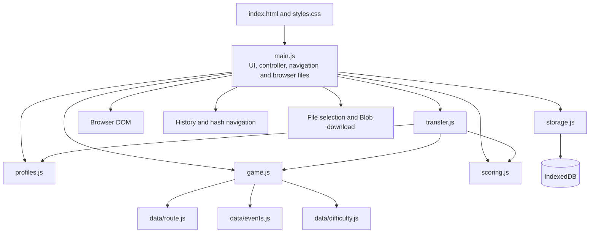

# Summit Challenge — Project Design Overview, Version 3.1 (As Deployed)

## Document status and authority

This is the current as-deployed design of Summit Challenge as of 17 August 2026.
It records how the Version 3 product was actually implemented, verified and
published.

The [Version 3 specification](specifications/summit-challenge-specification-v3.md)
remains authoritative for product behavior. This document incorporates the
[Version 3 planned design](design-overview-v3.md) by reference and supersedes it
only where this document identifies an as-built decision or a production fact.
Unchanged design principles, requirements mappings, threat analysis and
operating responsibilities in that baseline still apply.

This is a Version 3.1 design revision rather than a Version 4 product design.
The deployed product does not introduce a material requirements, trust-boundary,
storage-ownership or runtime-topology change that would justify a new major
specification version.

## 1. Revision summary

Version 3.1 changes the design record from planned to as deployed. It:

- identifies the deployed repository, revision, site origin and project base path;
- records the source modules and IndexedDB schema that were actually implemented;
- documents the deliberate consolidation of the planned UI, navigation and
  controller modules;
- records the installed toolchain and least-privilege GitHub Pages workflow;
- links production verification evidence and identifies verification that is
  still outstanding; and
- captures accepted operational limitations discovered during deployment.

These changes improve traceability. They do not change the gameplay rules,
privacy posture or local-only data model defined by Specification Version 3.

## 2. Production baseline

| Item | Deployed value |
| --- | --- |
| Application package version | `1.0.0` |
| Authoritative product specification | Version 3 |
| Current design | Version 3.1 |
| Deployed source revision | `8c95565` |
| Repository | Public GitHub repository `Fe-Al/summit-challenge` |
| Production site | `https://fe-al.github.io/summit-challenge/` |
| Production origin | `https://fe-al.github.io` |
| Production base path | `/summit-challenge/` |
| Database | IndexedDB `summit-challenge-v3`, database version 1 |
| Stored-record schemas | Profile, game and result schema version 1 |
| Transfer format | Export/import schema version 1 |

The repository and site are intentionally public. No secret is needed by the
application or deployment workflow. Public source improves reviewability but
means repository history, workflow definitions and all committed material are
world-readable; credentials and private data must never be committed.

## 3. As-built runtime architecture



The small single-page application consolidates the separately planned `ui.js`,
`navigation.js` and application controller into `main.js`. This avoids thin
cross-calling modules while preserving the important boundaries:

- domain rules in `game.js`, `scoring.js` and `profiles.js` do not depend on the
  DOM, IndexedDB or a network service;
- `storage.js` is the only module that accesses IndexedDB and owns transaction
  boundaries;
- `transfer.js` validates, normalizes and serializes allow-listed data, while
  `main.js` owns the browser file picker and download interaction;
- route, event and difficulty definitions remain immutable data modules;
- routes are allow-listed, user-controlled text is rendered as text rather than
  HTML, and state-changing UI operations are serialized; and
- normal production execution performs no runtime third-party API request.

### 3.1 As-built source layout

```text
index.html                      CSP and application shell
src/main.js                     UI, controller, navigation and browser integration
src/game.js                     Pure deterministic game engine
src/scoring.js                  Pure scoring and result validation
src/profiles.js                 Profile validation and normalization
src/storage.js                  IndexedDB schema and atomic transactions
src/transfer.js                 Import/export validation and serialization
src/data/route.js               Route graph and segment definitions
src/data/events.js              Deterministic event definitions
src/data/difficulty.js          Difficulty definitions
src/styles.css                  Responsive presentation and interaction states
tests/                          Unit and persistence transaction tests
.github/workflows/              Verification and GitHub Pages deployment
```

## 4. As-built persistence design

The application retains the Version 3 rule of one local database, namespaced
object stores and opaque application-generated identifiers. The implemented
stores are:

| Store | Key path | Secondary indexes | Purpose |
| --- | --- | --- | --- |
| `profiles` | `id` | unique `canonicalUsername` | Up to eight local display profiles |
| `activeGames` | `profileId` | none | At most one resumable game per profile |
| `results` | `id` | non-unique `profileId` | Completed result history and leaderboard data |

The planned `updatedAt` and completion-ordering indexes were not required for the
bounded local data set. The application selects by profile where useful and
performs timestamp ordering in memory. The unique username index uses the
implemented name `canonicalUsername`; it enforces the same case-insensitive
uniqueness rule described by the planned `canonicalName` field.

Profile deletion and import replacement use single read-write transactions over
all affected stores. A failed validation or transaction therefore does not
intentionally leave a partially imported, replaced or deleted profile. Imported
results are rebuilt from allow-listed validated records and have their scores
recomputed rather than trusted.

IndexedDB remains device-, browser-profile- and origin-local. It is not an
authenticated account, synchronization service or durable server backup.

## 5. Build and deployment architecture

The production artifact is a static Vite build. GitHub Actions verifies and
deploys it directly to GitHub Pages; there is no application server, database,
server-side session, CDN script dependency or runtime package installation.

The deployed workflow uses Node.js 24 with a locked `npm ci` installation and
official GitHub Actions pinned to these immutable commits:

- `actions/checkout@fbc6f3992d24b796d5a048ff273f7fcc4a7b6c09` (`v5`);
- `actions/setup-node@249970729cb0ef3589644e2896645e5dc5ba9c38` (`v6`);
- `actions/configure-pages@45bfe0192ca1faeb007ade9deae92b16b8254a0d` (`v6`);
- `actions/upload-pages-artifact@fc324d3547104276b827a68afc52ff2a11cc49c9`
  (`v5`); and
- `actions/deploy-pages@cd2ce8fcbc39b97be8ca5fce6e763baed58fa128`
  (`v5`).

Dependabot checks these GitHub Actions pins weekly and proposes reviewed updates
rather than allowing a moving tag to change executable workflow code silently.

Pushes to `main` and manual dispatches verify and deploy. Pull requests run the
same install, audit, test and build gates but cannot configure or deploy Pages.
Top-level workflow permission is `contents: read`; only the dependent deployment
job receives `pages: write` and `id-token: write`. No deployment secret is stored.

CI supplies `VITE_BASE_PATH=/${{ github.event.repository.name }}/`, producing the
deployed `/summit-challenge/` base path. The local build fallback remains
`/Summit-Challenge/`; it is not used by the production workflow. Any repository
rename, owner change or custom-domain migration must be treated as an origin or
base-path migration and verified before release.

### 5.1 Repository change control

The default `main` branch is governed by an active repository ruleset. It:

- requires changes to pass through a pull request;
- requires the `verify-build` GitHub Actions check to succeed before merge;
- requires the pull-request branch to be current with the target branch;
- blocks branch deletion and non-fast-forward updates; and
- grants no configured bypass actor.

The repository currently has one maintainer, so the pull-request rule requires
zero approving reviews. Requiring an independent approval without a second
trusted maintainer would make legitimate changes unmergeable. If another trusted
maintainer is added, the required approval count should be raised to at least one
and code-owner review should be considered.

## 6. Verification and release evidence

The [initial production release record](releases/2026-08-17-initial-deployment.md)
is the evidence index for revision `8c95565`. At release time:

- the locked dependency installation succeeded;
- `npm audit --audit-level=high` reported no vulnerability at or above the
  release threshold;
- all 36 automated tests passed;
- the production Vite build succeeded;
- the deployed artifact was checked for secrets and unexpected external URLs;
- GitHub Actions run `32048932935` completed successfully;
- the production page returned successfully over HTTPS with the intended CSP and
  same-origin static resource behavior;
- a Chrome production smoke test covered profile creation, Normal game creation
  and the first walking segment; and
- Firefox 152 was manually confirmed to render the profile screen.

This evidence is not a claim of complete browser and accessibility certification.
The full manual matrix in the README remains outstanding for Edge, Safari,
iOS Safari, Android Chrome, keyboard-only use, screen readers, all complete game
outcomes and all storage/import failure scenarios.

## 7. Accepted deviations and operational concerns

### 7.1 Consolidated presentation modules

Combining presentation orchestration in `main.js` is accepted for this codebase's
size. If view logic grows enough to obscure state transitions or makes tests
materially harder, UI and navigation should be extracted without moving domain or
storage responsibilities into them.

### 7.2 Minimal secondary indexes

The implementation omits indexes that do not currently improve a bounded local
workload. Adding large histories or new query patterns requires reassessing this
decision and introducing an explicit IndexedDB migration.

### 7.3 Shared GitHub Pages origin

GitHub project sites for one owner share an origin. The distinct database name
avoids accidental naming collisions but is not a security boundary against other
code executing on that origin. A dedicated custom domain would improve origin
isolation, but moving origins disconnects existing local data unless each profile
is exported before the move and imported afterward.

### 7.4 Meta CSP limitation

The static page uses a restrictive meta Content Security Policy. A meta policy
cannot enforce response-header-only controls such as `frame-ancestors`, and the
current GitHub Pages deployment does not add custom response headers. This is an
accepted hosting limitation, not equivalent protection against framing.

### 7.5 Upstream deployment warning

The successful deployment currently emits a Node deprecation warning from the
upstream `actions/deploy-pages@v5` action concerning its transitive use of the
`punycode` module. It does not originate in the application bundle and did not
affect the deployment. Maintainers should keep official actions current and
recheck the warning after upstream releases rather than suppressing it locally.

### 7.6 Administrative credential risk

The branch ruleset prevents ordinary direct pushes but cannot stop a compromised
repository owner or integration with administrative permission from changing or
removing the ruleset itself. The owner must use phishing-resistant two-factor
authentication where available and periodically review sessions, personal access
tokens, SSH and deploy keys, collaborators and installed GitHub Apps. Integrations
should receive only the repositories and permissions they need.

### 7.7 Local data and integrity limitations

Local profiles are unauthenticated. Anyone with the same browser profile can use
them, browser tooling can edit data and scores, and storage can be cleared,
evicted or denied. Export files contain unencrypted profile and game data. These
constraints are deliberately visible to users; the leaderboard is casual and is
not proof of identity, chronology or fair play.

## 8. Change control

Future changes require a new design revision when they materially affect the
runtime topology, trust boundaries, data ownership or migrations, deployment
permissions, production origin, dependency policy or operating responsibilities.
A new authoritative product specification is required when behavior or product
requirements change materially. Small implementation corrections may instead be
recorded in a release record when this design remains accurate.
