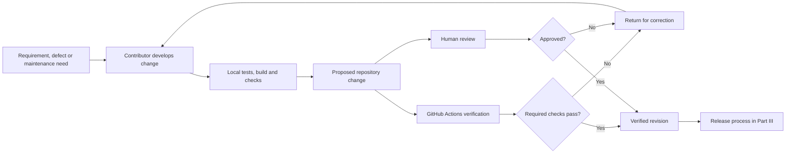
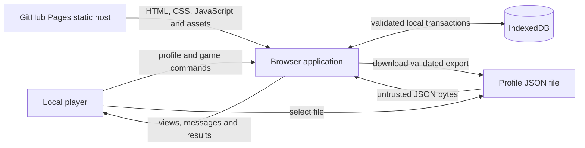
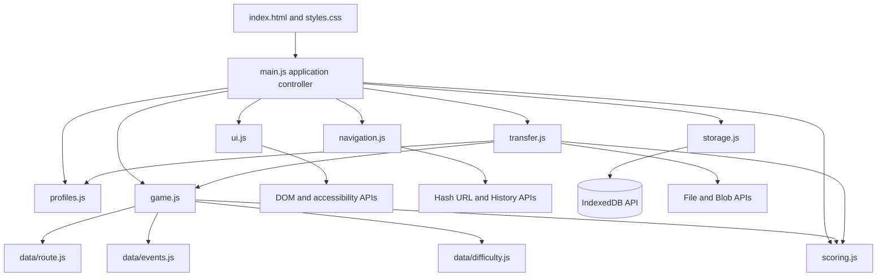
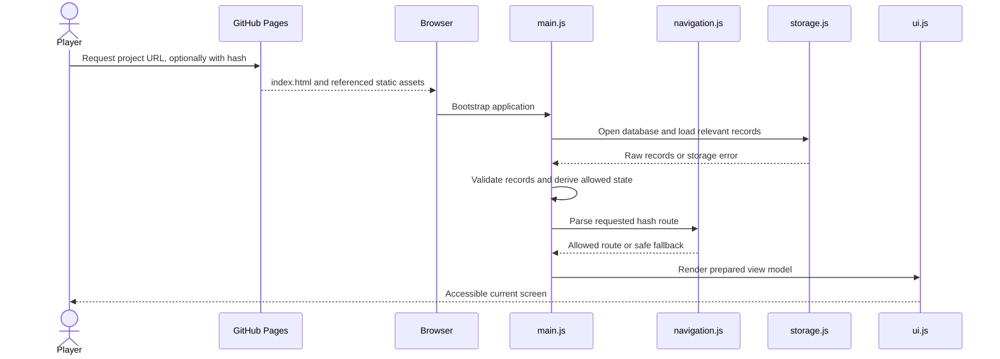
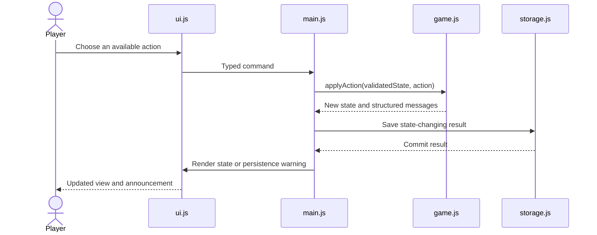
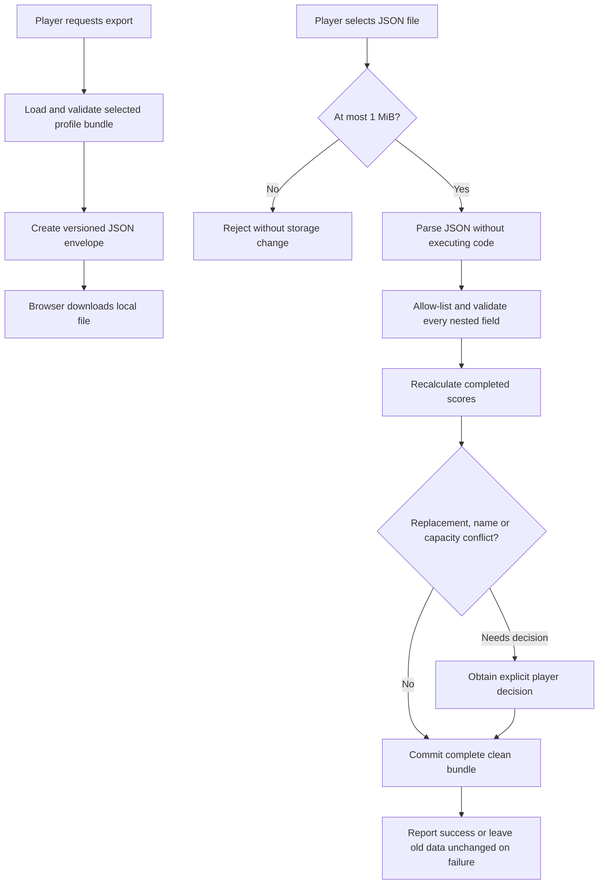
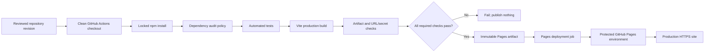
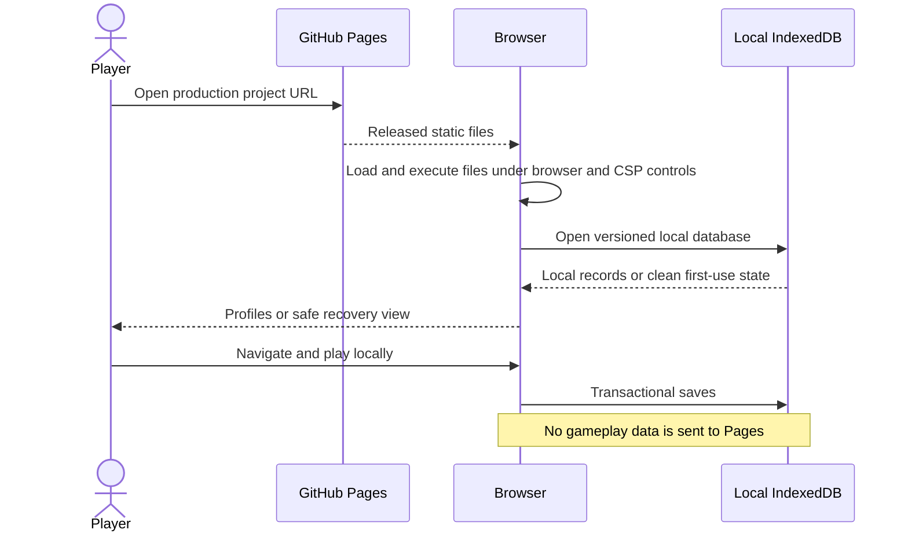

# Summit Challenge — Project Design Overview, Version 3

> **Archived planned baseline.** This document records the Version 3 design before
> implementation. For the current deployed architecture and operational evidence,
> see [Project Design Overview, Version 3.1](design-overview-v3.1.md). The
> [Version 3 specification](specifications/summit-challenge-specification-v3.md)
> remains the authoritative product specification.

## Document status and authority

This document describes the intended design of Summit Challenge Version 3. The project is currently in the specification stage; the components and processes below are planned rather than descriptions of an already deployed system.

This design complements the [current implementation specification](specifications/summit-challenge-specification-v3.md). The specification defines product requirements and is authoritative if the documents conflict. This document explains how the development capability, runtime architecture and production delivery model satisfy those requirements.

The design is organised into three deliberately separate parts:

1. **Development capability** — human development roles, tools, environments, source control and verification.
2. **System architecture and processes** — users, hardware and software, repositories, trust boundaries, application modules, data and principal runtime flows.
3. **Deliverable products and production** — release outputs, deployment, production use, operational responsibilities and handoff evidence.

The separation prevents development responsibilities from being mistaken for application features. A repository maintainer, reviewer or deployment workflow is not a privileged game user. Conversely, a local player has no development or repository privileges merely by using the application.

## Design principles

- Keep the implementation small, static and local-first.
- Keep game and scoring rules deterministic and independent of browser APIs.
- Separate human accountability from automated execution.
- Separate source repositories, runtime data stores and release artifacts.
- Validate all data when it crosses a trust boundary.
- Minimise dependencies, workflow permissions and production network activity.
- Make failure, recovery and data-loss limitations visible to players and maintainers.
- Provide responsive, keyboard-accessible and screen-reader-friendly interactions.
- Preserve traceability from requirements through design, verification and release evidence.

---

# Part I — Development Tools, Environments and Roles

## 1. Development scope

Development covers the activities needed to turn the specification into a reviewed, tested and deployable static application:

- editing application source, tests, workflows and documentation;
- managing dependencies and the lockfile;
- running local and automated verification;
- reviewing changes and release evidence;
- building the static production artifact;
- configuring the source repository and GitHub Pages environment; and
- publishing an approved artifact.

Development does not include administering player profiles, changing scores, viewing browser-local game data or operating a backend. The product has no application administrator role.

## 2. Human development roles

Roles describe responsibilities and authority, not necessarily different people. In a small project one person may hold several roles, but each decision must still be made from the correct role and with the evidence required for that responsibility.

| Human role | Primary responsibilities | Authority | Explicitly not responsible for |
|---|---|---|---|
| Contributor/developer | Implement source, tests and documentation; run local checks; propose changes | Work in a development checkout and submit proposed changes | Approving their own change merely because they wrote it; administering player data |
| Reviewer | Check requirements, design consistency, correctness, security, accessibility and test evidence | Approve, request changes or reject a proposed change according to repository policy | Operating the game for players; bypassing failed required checks |
| Repository maintainer | Protect branches, manage collaborators, review dependency/workflow updates and maintain repository settings | Configure the GitHub source repository within the project's governance rules | Acting as an in-application administrator or accessing local player databases |
| Release maintainer | Confirm release readiness, verify the intended revision and oversee the Pages environment | Approve or initiate production publication when required by repository settings | Modifying the artifact after verification or overriding failed release gates |
| Documentation maintainer | Keep specifications, design, README guidance and limitations aligned | Propose and review documentation changes | Redefining product requirements without updating the authoritative specification |

Recommended separation rules:

1. A change author supplies evidence; review assesses that evidence.
2. Required automated checks cannot be replaced by a role assertion.
3. Workflow and dependency changes receive the same review discipline as application code.
4. A release uses the reviewed repository revision and its generated artifact; it is not rebuilt from uncommitted local files.
5. When one person holds multiple roles, the repository history and checklist should still record the distinct implementation, review and release decisions.

## 3. Automated development systems

Automated systems execute configured tasks but do not hold human accountability.

| System | Function | Inputs | Outputs | Human owner |
|---|---|---|---|---|
| Git | Local version control | Working-tree changes | Commits and diffs | Contributor |
| GitHub source repository | Shared source control and review boundary | Reviewed commits, settings and workflow definitions | Version history and workflow events | Repository maintainer |
| Vite | Development server and production builder | Application source and explicit base-path configuration | Local development assets or static production files | Contributor |
| Vitest | Unit-test runner | Test suites and application modules | Deterministic pass/fail results | Contributor and reviewer |
| npm | Locked dependency installation and script execution | `package.json` and `package-lock.json` | Installed dependency graph and command results | Contributor; maintainer reviews changes |
| GitHub Actions | CI and deployment automation | Repository revision and workflow configuration | Verification results, Pages artifact and deployment result | Repository/release maintainer |
| GitHub Pages | Static hosting service | Verified Pages artifact | Released same-origin files over HTTPS | Release maintainer configures the environment |

Automation may report success or failure. It does not independently decide that a requirement is acceptable, that a risk is justified or that documentation is accurate.

## 4. Development environments

### 4.1 Developer workstation

The developer workstation is a human-controlled computer capable of running the supported Node.js and browser toolchain. No particular processor architecture, operating system or vendor is part of the product design.

Expected software:

- Git;
- a project-supported Node.js LTS release and npm;
- Vite and Vitest installed from the committed lockfile;
- a text editor or IDE;
- supported desktop browsers and browser developer tools; and
- optional mobile devices or device emulation for responsive checks.

The workstation may contain uncommitted work and local test data. It is not a production environment or release source of record.

### 4.2 Local application environment

Vite serves the application for development with fast module loading and a local origin. This environment is used for implementation, exploratory testing and browser debugging. Its origin and storage are separate from production, so its IndexedDB data is not production player data.

Local development behavior must not be assumed to prove:

- the configured GitHub project-site base path works;
- the production content security policy is effective;
- the built artifact contains no unexpected files or URLs; or
- production-origin storage migration has been handled.

Those properties are checked against the production build or deployed environment.

### 4.3 Continuous-integration environment

GitHub Actions starts from a clean repository checkout. It installs the committed dependency graph, applies the documented audit policy, runs tests, builds the application and creates a Pages artifact only when required checks succeed.

The CI environment is ephemeral. It must not depend on files, credentials, packages or state present only on a developer workstation.

### 4.4 Review environment

Review uses repository diffs, automated check results and, when proportionate, a locally built preview or downloaded candidate artifact. Review covers source, tests, dependencies, workflows and documentation as separate change types with different risks.

### 4.5 Production environment

Production is the GitHub Pages origin that serves the approved static artifact. It is described operationally in Part III. It has no server-side application process, database or administrative console belonging to Summit Challenge.

## 5. Toolchain decisions and constraints

| Concern | Selected approach | Design reason |
|---|---|---|
| Application language | Semantic HTML, modern CSS and vanilla JavaScript modules | Keeps runtime and dependency surface small |
| Development/build tool | Vite | Provides local development and a static production build with an explicit project-site base path |
| Unit tests | Vitest | Fits the JavaScript module and Vite toolchain |
| Package management | npm with committed `package-lock.json` | Reproducible locked installation |
| Source and review | Git and GitHub | Version history, review and workflow integration |
| CI/CD | GitHub Actions | Runs verification and publishes a Pages artifact with scoped permissions |
| Production host | GitHub Pages | Serves the static application without a backend |
| Runtime storage | Browser IndexedDB | Keeps profiles, active games and results on the player's device |

Production dependencies remain minimal. The design does not add a front-end framework, authentication library, database client, analytics library, external font, runtime CDN dependency or service worker.

## 6. Source repository organisation

The planned source repository separates runtime source from development and delivery support:

```text
README.md                         Project entry point and operating guidance
docs/
  design-overview-v3.md           Current architecture and delivery design
  design-overview-v2.md           Archived Version 2 design
  design-overview-v1.md           Archived Version 1 design
  specifications/                 Current and archived product requirements
tests/
  profiles.test.js
  game.test.js
  scoring.test.js
  storage.test.js
  transfer.test.js
.github/
  workflows/
    deploy-pages.yml              Verification and Pages deployment
package.json                      Commands and direct dependency declarations
package-lock.json                 Locked dependency graph
index.html                        Browser application entry point
src/                              Runtime source described in Part II
```

The GitHub repository is the source of record for reviewed source and workflow definitions. It is not the runtime profile repository, the deployed website or the browser's IndexedDB database.

## 7. Development and change flow



For each material change, the responsible people should:

1. confirm the current specification and design scope;
2. preserve unrelated repository work;
3. update implementation, tests and documentation together where needed;
4. update the lockfile when dependencies change;
5. run the documented audit, test and production-build commands;
6. perform proportionate responsive, accessibility and browser checks;
7. inspect the built output for secrets and unexpected external URLs; and
8. merge or release only when the required evidence is satisfactory.

## 8. Verification design

| Verification area | Primary evidence |
|---|---|
| Profile rules | Normalisation, validation, case-insensitive uniqueness, eight-profile limit and injected UUID/clock tests |
| Game engine | Valid transitions, costs, journey reversal, deterministic events, equipment, darkness and outcomes |
| Scoring | Rewards, penalties, eligibility, bounds and breakdown arithmetic |
| Persistence | Schema upgrades, profile isolation, one active game and atomic completion/deletion/import |
| Import/export | Round trip, size/version/type validation, score recomputation, conflicts and hostile JSON shapes |
| Navigation | Refresh, Back/Forward, invalid routes and profile-switch history cleanup |
| Interface | Semantic output, keyboard and touch behavior, focus, live announcements and safe rendering |
| Integrated product | Principal flows, storage failures, cleared data, supported browsers and responsive layouts |
| Build and release | Locked install, audit policy, tests, production build, artifact inspection and least privilege |

Vitest suites exercise public module behavior with deterministic fixtures and injected clock, UUID and random inputs. Browser checks cover a 320-CSS-pixel viewport, a representative desktop viewport and supported browsers. When a supported browser or real touch device cannot be automated, release evidence identifies the manual checks performed or still required.

## 9. Development security and governance

- Do not commit passwords, tokens, API keys, personal information or analytics identifiers.
- Review dependency additions and lockfile changes; avoid packages that duplicate simple platform capabilities.
- Apply the documented dependency-audit policy without silently ignoring failures.
- Pin GitHub Actions to reviewed versions or commit SHAs according to repository policy.
- Do not use `pull_request_target` for untrusted contributed code.
- Give build and test jobs `contents: read` only.
- Give only the deployment job `pages: write` and `id-token: write`.
- Do not grant `contents: write` without a documented future requirement.
- Prevent untrusted pull-request code from receiving elevated credentials.
- Retain failed checks and known manual-verification gaps in release evidence.

---

# Part II — System Architecture and Main Process Flows

## 10. Product scope and runtime goals

Summit Challenge is a static, local-only hiking strategy game. A player attempts to reach a fictional summit and return safely while managing route choice, energy, hydration, daylight, supplies, equipment and deterministic events.

The runtime application has no backend, registration, authentication, cookies, analytics or external API. Profiles, active games and results remain in IndexedDB on the player's browser origin unless the player explicitly exports one profile to a JSON file.

Runtime goals are to:

- keep game rules reproducible after saving and restoration;
- keep DOM, navigation, storage and file APIs outside pure domain logic;
- maintain at most eight pseudonymous local profiles per browser storage origin;
- prevent one selected profile from displaying another profile's records through the supported interface;
- make related state changes atomic where practical;
- treat stored records, URL state and imported files as untrusted;
- make no application-data requests to external origins during normal use; and
- recover safely from invalid state or unavailable storage without silent data loss.

## 11. Runtime users, actors and systems

The classifications in this table are intentional:

| Entity | Classification | Runtime responsibility or interaction | Privileges and limitations |
|---|---|---|---|
| Local player | Human product user | Creates/selects a profile, plays games, views local results and imports/exports a profile | Controls only data available to the current browser origin; has no authenticated identity or repository privilege |
| Browser application | Runtime software system | Validates commands, applies rules, renders views and coordinates storage/navigation/files | Has browser-granted access to its same-origin APIs; has no server or GitHub credentials |
| Browser | Execution platform | Runs HTML/CSS/JavaScript and provides DOM, History, IndexedDB, File, Blob, clock and cryptographic APIs | Enforces browser origin and platform behavior |
| IndexedDB | Runtime data repository | Stores profiles, active games and results | Local to a browser storage origin; editable and clearable by the device user |
| Import/export file | User-controlled transfer medium | Carries one versioned profile bundle between browser storage areas | Untrusted on import; not proof of identity or score authenticity |
| GitHub Pages | External static-hosting system | Serves released HTML, CSS, JavaScript and static assets | Does not execute Summit Challenge server logic or store gameplay records |

The repository maintainer and developer roles from Part I are absent from this runtime table because they are not application users. GitHub Pages is a hosting system, not a human actor. IndexedDB is a data store, not a source repository or identity provider.

## 12. Hardware and execution topology

Summit Challenge requires no dedicated project-owned production hardware.

| Location | Hardware responsibility | Summit Challenge software present | Persistent project data |
|---|---|---|---|
| Player device | Player/device owner provides a supported phone, tablet or computer | Supported browser and downloaded static application | IndexedDB records and optional exported JSON files |
| GitHub Pages infrastructure | GitHub operates managed hosting hardware | Released static files | Deployed site artifact; no player gameplay database |
| GitHub Actions infrastructure | GitHub operates ephemeral CI runners | Locked development toolchain during a workflow run | Workflow logs and artifacts according to GitHub retention/settings |
| Developer workstation | Contributor provides a suitable development computer | Git, Node.js/npm, Vite, Vitest, browsers and editor | Working tree, dependency cache and local test data |

Minimum user-facing capabilities are a supported modern browser with JavaScript modules, IndexedDB, History, File/Blob and Web Crypto APIs, plus enough local storage for the bounded game data. Exact supported browser versions belong in the README and release verification record.

## 13. Runtime system context and network boundary



Only static application delivery crosses the production network boundary. Once the required files are loaded, ordinary profile management, gameplay, scoring and persistence occur locally. Hash-route changes such as `#/menu` to `#/game` are handled in the browser and do not themselves request another server route.

JavaScript can technically transmit browser data, so this property is enforced by source review, tests, artifact inspection and a restrictive content security policy—not by assuming that client code is inherently local.

## 14. Boundaries and trust model

| Boundary | Data crossing it | Trust treatment | Control |
|---|---|---|---|
| Player input → UI | Names, actions, confirmations and file selections | Untrusted | Length/type rules, explicit commands and safe text rendering |
| URL → navigation | Hash route and browser history events | Untrusted | Allow-listed routes and safe fallback/redirect |
| IndexedDB → application | Previously stored records | Untrusted | Schema and domain validation before use |
| File → import | Up to 1 MiB of JSON bytes | Hostile input | Size limit, non-executing parse, field allow-list, reconstruction and consistency checks |
| Domain modules → storage | Validated profiles, game states and results | Trusted only for the current operation | Storage constraints and atomic transactions add protection |
| Build artifact → browser | Reviewed release files | Release-controlled input | CI gates, artifact inspection, HTTPS and CSP |
| Browser origin → other origins | Potential network requests | Disallowed during normal product use | No external runtime dependencies, review, tests and CSP |

Local profile isolation is a product behavior, not a security boundary against the device owner or other scripts on the same browser origin. Local timestamps and scores are editable and cannot prove achievement.

## 15. Repositories, stores and artifacts

The word *repository* has several possible meanings; the design uses these precise terms:

| Item | Kind | Contents | Authority and lifetime |
|---|---|---|---|
| GitHub source repository | Version-control repository | Source, tests, lockfile, workflows and documentation | Source of record for reviewed revisions |
| npm package registry | Development dependency source | Third-party tool packages referenced by the lockfile | External supply-chain input used during install, not at runtime |
| IndexedDB database | Runtime data repository | Local profiles, active games and completed results | Authoritative only for the current browser origin's casual local state |
| Profile JSON file | Portable user data artifact | One profile, optional active game and results | User-controlled backup/transfer input; validated before import |
| GitHub Actions artifact | Release candidate artifact | Static production build | Immutable input to the corresponding deployment; retained per platform settings |
| GitHub Pages site | Deployed static release | Public HTML, CSS, JavaScript and assets | Current production presentation of an approved artifact |

These stores are not interchangeable. In particular, deploying a new site version does not migrate IndexedDB records between origins, and importing a profile does not change source or production files.

## 16. Application module architecture



Dependency rules:

1. `main.js` is the composition root and serialising application controller.
2. `ui.js` emits typed commands; it does not mutate game state or IndexedDB directly.
3. `storage.js` is the only module that calls IndexedDB.
4. `transfer.js` is the only module that parses imports or creates export downloads.
5. Game, scoring, profile and configuration modules do not access the DOM, storage or network.
6. Data modules are immutable dependency leaves.
7. Modules do not create circular imports.
8. Authoritative mutable state belongs to the controller or IndexedDB, not module-level globals.

## 17. Runtime source structure and responsibilities

```text
index.html
src/
  main.js                 Bootstrap, command serialisation and coordination
  navigation.js           Allow-listed hash routes and browser history
  ui.js                   DOM rendering, events, focus and announcements
  profiles.js             Pure profile rules and validation
  game.js                 Pure deterministic game state machine
  scoring.js              Pure score calculation and eligibility
  storage.js              IndexedDB repository and transactions
  transfer.js             JSON export/import boundary
  styles.css              Responsive and accessible presentation
  data/
    route.js              Immutable route graph
    events.js             Immutable event definitions
    difficulty.js         Immutable difficulty configuration
```

| Module | Main responsibility | Boundary rule |
|---|---|---|
| `main.js` | Bootstrap, load validated state, dispatch commands, coordinate domain calls and persistence, and produce view models | Never calls IndexedDB directly |
| `navigation.js` | Parse allowed hash routes and coordinate refresh and Back/Forward behavior | Stores no profile or game data in URLs |
| `ui.js` | Render semantic views, bind input, manage focus/busy state and announce updates | User/import values are rendered as text, not HTML |
| `profiles.js` | Normalise, canonicalise, validate and create pseudonymous local profiles | Pure domain logic with injected clock/UUID where needed |
| `game.js` | Create and validate states, apply actions, resolve deterministic events and determine outcomes | Reads no uncontrolled clock or randomness during an action |
| `scoring.js` | Calculate bounded score totals, breakdowns and eligibility | Pure; imported stored totals are ignored and recalculated |
| `storage.js` | Read and transactionally write profiles, active games and results | Sole IndexedDB adapter |
| `transfer.js` | Build exports and parse, validate and reconstruct imports | Does not write storage; controller requests the final transaction |
| `data/*.js` | Define route, event and difficulty configuration | Immutable dependency leaves |

The implementation may split `ui.js` into smaller view modules while preserving these boundaries.

## 18. Runtime data model

### 18.1 Ownership relationships

```text
Profile (1)
├── Active game (0..1)
└── Completed results (0..many)
```

Opaque profile IDs establish ownership. Display names never act as ownership keys.

| IndexedDB store | Key | Important indexes | Value |
|---|---|---|---|
| `profiles` | `id` | Unique `canonicalName`; `createdAt` | Validated profile |
| `activeGames` | `profileId` | `updatedAt` | One versioned game-state wrapper per profile |
| `results` | `resultId` | `profileId` and completion ordering where supported | Immutable completed result |

Required atomic operations are profile creation with count/name enforcement, profile deletion with all owned records, game completion with active-save removal, and complete profile import/replacement.

### 18.2 Principal data contracts

The following are conceptual shapes; exact validators and schema versions are implementation details constrained by the specification.

```js
const profile = {
  id: "random UUID",
  displayName: "Alice_1",
  canonicalName: "alice_1",
  createdAt: "ISO-8601 timestamp"
};
```

```js
const gameState = {
  schemaVersion: 1,
  gameId: "random UUID",
  profileId: "profile UUID",
  difficulty: "easy | normal | hard",
  phase: "outbound | returning | terminal",
  currentNodeId: "route node ID",
  selectedSegmentId: null,
  traversedSegmentIds: [],
  returnSegmentIds: [],
  summitReached: false,
  resources: {},
  equipment: {},
  rng: { seed: 0, state: 0 },
  pendingEvent: null,
  statistics: {},
  startedAt: "ISO-8601 timestamp",
  updatedAt: "ISO-8601 timestamp",
  outcome: null,
  messages: []
};
```

```js
const exportEnvelope = {
  format: "summit-challenge-profile",
  version: 1,
  exportedAt: "ISO-8601 timestamp",
  profile: {},
  activeGame: null,
  results: []
};
```

The deterministic pseudo-random generator and its serialisable state must be documented so restoration produces the same next event. Completed results retain canonical scoring inputs so imported scores can be recalculated rather than trusted.

## 19. Main runtime process flows

### 19.1 Application load and navigation



The URL fragment is interpreted locally and is not sent as part of the HTTP request. Unknown routes and routes incompatible with current application state resolve to a safe screen.

### 19.2 Game action and autosave



Commands are serialised so repeated input cannot create concurrent duplicate writes. Invalid actions leave state unchanged and produce a concise explanation.

### 19.3 Game completion

1. `game.js` returns a terminal state with exactly one outcome.
2. `scoring.js` calculates the bounded score, breakdown and eligibility.
3. `main.js` constructs a clean completed result.
4. `storage.js` inserts the result and deletes the active game in one transaction.
5. `ui.js` displays the persisted result or labels it unsaved and provides recovery guidance.

### 19.4 Profile selection and deletion

- Selecting a profile validates its records before rendering them.
- Switching profiles clears the previous profile's rendered and in-memory state before loading the next profile.
- Navigation history is replaced where needed so Back cannot reveal stale data from the previous profile.
- Deletion requires confirmation naming the profile and removes the profile, its active game and its results in one transaction.
- A failed deletion leaves the complete previous bundle available or reports a recoverable error; partial deletion is not acceptable.

### 19.5 Export and import



Import/export is manual backup and transfer. It is not authentication, synchronisation or evidence that a score is genuine.

## 20. Error handling, security, privacy and accessibility

### 20.1 Error and recovery model

Expected error categories include validation errors, invalid commands, corrupt or unsupported records, unavailable or full storage, blocked database upgrades, import conflicts/failures and programming errors.

The application must:

- reject invalid input before committing it;
- avoid continuing from partially updated state;
- preserve previous durable state when a transaction fails;
- distinguish an unsaved result from a persisted result;
- provide concise recovery guidance without exposing unsafe data; and
- return to a safe profiles or menu view when the requested state is unavailable.

### 20.2 Security and privacy controls

- Local profiles are convenience identities, not authenticated accounts.
- No credentials, privileged secrets or personal information belong in runtime code or storage.
- The application does not collect IP addresses, fingerprint devices, set cookies or use analytics.
- IndexedDB, URLs and imported files are untrusted inputs.
- User/import values are rendered through safe text APIs.
- The application does not evaluate strings or import executable code from files.
- External scripts, styles, fonts, images, CDNs and runtime APIs are excluded.
- A restrictive meta CSP permits only required same-origin resources and connections.
- GitHub Pages cannot provide arbitrary response headers; unsupported meta-policy directives such as `frame-ancestors` are documented limitations.

### 20.3 Accessibility and interaction qualities

- Mobile-first layout without horizontal scrolling at 320 CSS pixels.
- Touch targets at least 44 by 44 CSS pixels.
- Semantic structure, labels and controls.
- Full keyboard operation and visible focus.
- Appropriate live announcements without repeating the whole interface.
- Errors and destructive confirmations available to screen readers.
- Resource danger communicated by more than colour.
- Reduced-motion preferences respected.

## 21. Deferred and excluded design

The following require a future specification and design review rather than extension by assumption:

- backend accounts, authentication or recovery;
- shared, global or cheat-resistant leaderboards;
- automatic cross-device synchronisation;
- multiple routes, multiplayer, chat or comments;
- payments, advertising or analytics;
- external weather, map, GPS or other runtime APIs;
- service workers, installable offline mode or push notifications;
- administrator interfaces; and
- alternate hosting or a reverse proxy added solely for response headers.

A future backend must not automatically trust existing local UUIDs, browser timestamps, imported files or scores.

---

# Part III — Deliverable Products, Deployment and Production Use

## 22. Deliverable taxonomy

The project produces several distinct deliverables. Only one is the deployed runtime product.

| Deliverable | Producer | Consumer | Contents and purpose |
|---|---|---|---|
| Reviewed source baseline | Contributors, reviewers and repository maintainer | Future contributors and CI | Approved source, tests, workflows, lockfile and documentation at a specific revision |
| Design and operating documentation | Documentation contributors and reviewers | Developers, maintainers, release maintainers and players where applicable | Requirements, architecture, setup, use, limitations and recovery guidance |
| Verification evidence | Local tools, CI and human testers | Reviewer and release maintainer | Test/audit/build results, artifact inspection and manual browser/accessibility checklist |
| Static production artifact | Vite build executed by GitHub Actions | GitHub Pages deployment job | Immutable HTML, CSS, JavaScript and required static assets configured for the project base path |
| Deployed production site | GitHub Pages | Local player browsers | Public HTTPS representation of the approved static artifact |
| Profile export | Running browser application at the player's request | Player or another Summit Challenge browser storage area | Versioned JSON backup/transfer file; a user-created operational output, not a software release |

Source files, test results, build artifacts and deployed files must not be described as though they were the same object. A release is traceable to a source revision and its verified artifact.

## 23. Production artifact design

Vite transforms the reviewed application source into static output similar to:

```text
dist/
  index.html
  assets/
    application-[hash].js
    application-[hash].css
    other-required-static-assets
```

The exact generated filenames are build outputs rather than stable interfaces. The artifact must:

- use the explicit GitHub project-site base path;
- support hash-based navigation without server rewrites;
- include only required runtime files;
- include no source-only tests, local configuration, credentials or secrets;
- make no unexpected references to external origins;
- include the restrictive production meta CSP; and
- be the same artifact passed to the deployment job after verification.

The original repository is not sent wholesale to the browser. Browsers request `index.html` and referenced assets from the deployed artifact, subject to ordinary caching behavior.

## 24. Build, release and deployment flow



No required installation, audit, test, build or inspection failure may be converted into a successful deployment. The deployment consumes the verified artifact rather than rebuilding different files.

## 25. Deployment configuration and privileges

| Activity | Required capability | Prohibited excess |
|---|---|---|
| Checkout/build/test | `contents: read` | Repository write access or production deployment credentials |
| Upload Pages artifact | Permission required by the maintained official Pages action | Arbitrary repository mutation |
| Deploy Pages | `pages: write` and `id-token: write`, scoped to the deployment job | Long-lived application secrets or broad write tokens |
| Configure Pages environment | Repository/release maintainer access | In-application player-data access, which does not exist |

The production application needs no repository or application secrets. The workflow avoids privileged execution of untrusted pull-request code and deploys only the intended branch/revision under the documented repository policy.

GitHub Pages configuration and owner actions include selecting GitHub Actions as the Pages source, protecting the deployment environment where appropriate, confirming the public project URL and base path, and maintaining the documented workflow permissions.

## 26. Production-use flow



Production use has these characteristics:

- the player accesses a public static URL without registering;
- the browser downloads the files it needs and may cache them;
- hash routes select screens locally;
- profiles, saves and results are stored under the exact production origin;
- clearing site data removes local records unless the player has exported them;
- private/incognito modes or storage restrictions may make data temporary or unavailable; and
- local data and scores remain editable by the device user.

## 27. Production ownership and operational roles

| Role or system | Production responsibility | Does not do |
|---|---|---|
| Local player | Use the application, manage local profiles, decide whether to export backups and understand local-data limitations | Administer releases or obtain support-backed account recovery |
| Browser | Enforce origin behavior, execute the application and persist local data when available | Guarantee permanent storage or score authenticity |
| GitHub Pages | Serve the deployed static files over the configured origin | Run game logic on a server, authenticate players or store gameplay data |
| Release maintainer | Keep Pages/repository deployment settings correct and assess release evidence | View, edit or recover player-local IndexedDB data |
| Repository maintainer | Maintain source/workflow security and access policy | Operate as an application administrator |
| GitHub Actions | Execute the approved workflow and report deployment status | Accept product risk or override a failed control |

There is no production support operator with technical access to player data. Recovery is limited to guidance, browser capabilities and player-created exports.

## 28. Release acceptance and handoff

A release candidate is acceptable only when:

1. the implementation remains within the current specification and this design;
2. locked installation and the audit policy succeed;
3. required automated tests pass;
4. the Vite production build succeeds with the explicit Pages base path;
5. the artifact contains no secrets or unexpected external URLs;
6. hash navigation, refresh and Back/Forward behavior work from the deployed base path;
7. local persistence, profile isolation, deterministic restoration and transactional operations behave as specified;
8. hostile imports fail without modifying existing data;
9. the interface passes required keyboard, screen-reader, touch and responsive checks;
10. normal play produces no external runtime requests beyond loading same-origin static files;
11. workflow permissions remain least-privilege and failed gates prevent deployment; and
12. README and in-application guidance accurately explain use, backup, privacy and limitations.

The handoff report separates:

- completed source and documentation;
- automated test, audit and build evidence;
- manual browser/device/accessibility checks completed or outstanding;
- artifact inspection results;
- GitHub Pages owner or environment setup actions;
- deployed revision, artifact and production URL; and
- known browser-storage, CSP, origin, browser-support and casual-score limitations.

## 29. Production change, rollback and data continuity

A production change follows the same verified pipeline as an initial release. Files are replaced by deploying another approved artifact; production files are not edited manually.

If a release is faulty, the release maintainer may redeploy a previously reviewed revision through the controlled workflow. A code rollback does not automatically roll back IndexedDB schema or player records. Storage schema changes therefore require forward/backward compatibility analysis, transactional migration and recovery guidance before release.

Changing the GitHub Pages owner, repository path, protocol, hostname, port or custom domain may change the browser origin or application base path. Because browser storage is origin-bound:

1. announce the change and its effect before deployment;
2. instruct players to export profiles from the old origin while it is available;
3. deploy and verify the new origin/base path; and
4. instruct players to import their backups at the new origin.

The project cannot centrally migrate or recover local profiles because it never receives them.

## 30. Documentation maintenance and traceability

Documentation remains divided by purpose:

| Question | Primary location |
|---|---|
| What must the product do? | Current implementation specification |
| Who develops, reviews and releases it? | Part I of this design |
| Which tools and environments support development? | Part I of this design and README commands |
| What runs in the browser and how is it structured? | Part II of this design |
| Where does data cross a trust boundary? | Part II of this design |
| What files and evidence constitute a release? | Part III of this design |
| How is it deployed and operated? | Part III of this design and README setup instructions |
| How does a player use, back up or recover local data? | README and in-application guidance |

Material requirement changes update the specification first or in the same reviewed change. Architecture, workflow, dependency, origin, storage-schema or operating-model changes update this design and the relevant verification evidence. User-visible setup, use or limitation changes also update the README and, where appropriate, the application text.

## 31. Summary of separation rules

1. **Human roles are accountable; automated systems execute configured work.**
2. **Development systems produce the release; they are not part of gameplay.**
3. **The player is the only human runtime user; there is no application administrator.**
4. **The GitHub repository stores source, IndexedDB stores local game data, an Actions artifact carries a release candidate, and GitHub Pages serves production files.**
5. **The static host delivers code but receives no gameplay data during normal use.**
6. **A verified artifact—not a workstation or mutable working tree—is the deployment input.**
7. **A production-origin change is also a browser-storage boundary change and requires explicit data-continuity guidance.**
