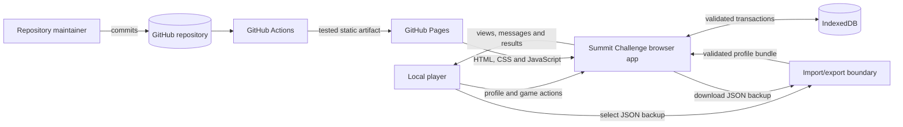
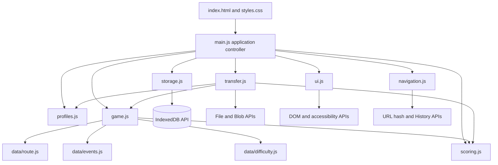
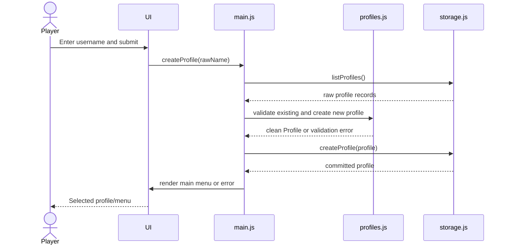
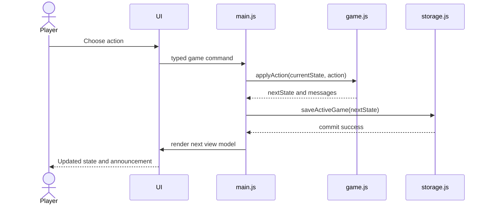

# Summit Challenge — Project Design Overview

## Document status

This document describes the intended implementation architecture for Summit Challenge Version 3. It complements the [current specification](specifications/summit-challenge-specification-v3.md); if the two documents conflict, the specification is authoritative.

The application is a static, local-only browser game. It has no backend, authentication, cookies, analytics or external runtime API. Profiles, active games and results live in the browser's IndexedDB database and may be manually transferred through validated JSON files.

## 1. Design goals

- Keep game and scoring rules deterministic, pure and easy to test.
- Keep DOM manipulation, navigation, storage and file handling outside domain logic.
- Permit no more than eight pseudonymous profiles in the current browser database.
- Isolate each profile's active game and results in the supported interface.
- Treat IndexedDB records and imported files as untrusted input.
- Make all state-changing storage operations transactional where practical.
- Make the static deployment safe without application secrets or external data collection.
- Preserve a small vanilla-JavaScript codebase with explicit module boundaries.

## 2. Users, systems and repositories

| Actor or boundary | Inputs to the application | Outputs received or stored |
|---|---|---|
| Local player | Profile name, difficulty, game actions, confirmations and selected import file | Rendered views, status announcements, game results, local scores and exported JSON file |
| Repository maintainer | Source changes, dependency updates and GitHub configuration | Test/build results and deployed GitHub Pages site |
| Browser runtime | Hash navigation events, clock values, cryptographic random values, IndexedDB/file API results | DOM updates, browser-storage transactions and file downloads |
| IndexedDB repository | Validated profile, game and result records | Stored profiles, one active game per profile and completed histories |
| Import/export file boundary | User-selected JSON bytes or a validated export model | Validated transfer model or downloaded UTF-8 JSON backup |
| GitHub source repository | Committed source, tests, lockfile and workflow | Version history and workflow input |
| GitHub Actions | Repository checkout and locked dependencies | Audit/test/build status and Pages deployment artifact |
| GitHub Pages | Static build artifact | HTML, CSS and JavaScript delivered to the player's browser |

An IndexedDB repository is a persistence abstraction inside the application. The GitHub repository is the source-control and deployment boundary. Neither is an authentication system.

## 3. System context



Runtime data flows only between the player, browser APIs and local IndexedDB. The production application does not send profile or gameplay data to GitHub or another service.

## 4. Module dependency rules



Rules:

1. `main.js` is the composition root and application controller.
2. UI modules emit commands; they do not update IndexedDB or game state directly.
3. `storage.js` is the only module that calls IndexedDB.
4. `transfer.js` is the only module that parses imported files or creates downloadable exports.
5. Game, scoring, profile validation and configuration modules do not access the DOM, browser storage or network.
6. Data/configuration modules are immutable dependency leaves and do not import application modules.
7. Modules must not create circular imports.
8. Mutable application state is owned by the controller or IndexedDB, never by module-level globals.

## 5. Proposed source structure

```text
index.html
src/
  main.js                 Application bootstrap and command coordination
  navigation.js           Hash routes and browser-history handling
  ui.js                   DOM rendering, event binding and announcements
  profiles.js             Pure local-profile rules and validation
  game.js                 Pure deterministic game state machine
  scoring.js              Pure score calculation and eligibility
  storage.js              IndexedDB repository and transactions
  transfer.js             JSON export/import boundary
  styles.css              Responsive and accessible presentation
  data/
    route.js              Immutable route graph
    events.js             Immutable random-event definitions
    difficulty.js         Immutable difficulty configuration
tests/
  profiles.test.js
  game.test.js
  scoring.test.js
  storage.test.js
  transfer.test.js
.github/workflows/
  deploy-pages.yml
```

The implementation may split `ui.js` into smaller view modules when it becomes large, provided those views retain the same input/output boundary.

## 6. Shared data contracts

The examples below are conceptual JavaScript object shapes. Runtime validators must check them before data loaded from storage or a file enters the application.

### Profile

```js
{
  id: "random UUID",
  displayName: "Alice_1",
  canonicalName: "alice_1",
  createdAt: "ISO-8601 timestamp"
}
```

### Game state

```js
{
  schemaVersion: 1,
  gameId: "random UUID",
  profileId: "profile UUID",
  difficulty: "easy | normal | hard",
  phase: "outbound | returning | terminal",
  currentNodeId: "route node ID",
  selectedSegmentId: "segment ID or null",
  traversedSegmentIds: [],
  returnSegmentIds: [],
  summitReached: false,
  resources: {
    energy: 100,
    hydration: 100,
    daylightMinutes: 480,
    foodRations: 3,
    waterPortions: 3
  },
  equipment: {
    rainJacketAvailable: true,
    firstAidAvailable: true,
    torchMinutesRemaining: 120
  },
  weather: "clear",
  rng: { seed: 0, state: 0 },
  pendingEvent: null,
  statistics: {
    distanceTravelledKm: 0,
    cumulativeAscentM: 0,
    minutesAfterDark: 0,
    actionsTaken: 0
  },
  startedAt: "ISO-8601 timestamp",
  updatedAt: "ISO-8601 timestamp",
  outcome: null,
  messages: []
}
```

The exact pseudo-random state shape depends on the chosen documented generator. It must be serialisable and reproduce the same next event after restoration.

### Player command

```js
{ type: "choosePath", segmentId: "segment ID" }
{ type: "continueWalking", confirmTorchUse: true }
{ type: "rest" }
{ type: "drink" }
{ type: "eat" }
{ type: "useEquipment", equipmentId: "firstAid" }
{ type: "turnBack" }
{ type: "abandon" }
```

Navigation, save, import/export and profile-management commands are application commands handled by `main.js`, not game actions passed to `game.js`.

### Completed result

```js
{
  schemaVersion: 1,
  resultId: "random UUID",
  profileId: "profile UUID",
  gameId: "game UUID",
  difficulty: "easy | normal | hard",
  startedAt: "ISO-8601 timestamp",
  completedAt: "ISO-8601 timestamp",
  outcome: "summitSafe | returnedSafe | rescue | abandoned",
  score: 0,
  scoreBreakdown: {},
  scoringInputs: {},
  statistics: {}
}
```

`scoringInputs` contains the canonical bounded values needed to recompute an imported score. Rescue and abandoned results have a leaderboard score of zero.

### Export envelope

```js
{
  format: "summit-challenge-profile",
  version: 1,
  exportedAt: "ISO-8601 timestamp",
  profile: {},
  activeGame: null,
  results: []
}
```

An imported envelope is untrusted until `transfer.js` validates and reconstructs every nested record.

## 7. Module contracts

### `main.js` — application controller

| Item | Design |
|---|---|
| Main data | Current profile ID, current route/view, transient UI status and currently loaded validated game state |
| Main functions | `bootstrap()`, `dispatch(command)`, `selectProfile(id)`, `startGame(difficulty)`, `handleGameAction(action)`, `completeGame(state)`, `switchView(route)` |
| Inputs | UI commands, navigation events, validated storage results and domain-function results |
| Outputs | View models to `ui.js`, navigation requests, storage repository calls and profile/game/score function calls |
| User boundary | Coordinates every user intent but receives it through `ui.js` rather than reading arbitrary DOM state throughout the module |
| Repository boundary | Calls `storage.js`; never calls IndexedDB directly |

Responsibilities:

- Open storage and load the local profile list during bootstrap.
- Select the correct initial view from storage and URL state.
- Serialise commands so double-clicks cannot create duplicate writes.
- Revalidate current profile/game records returned by storage.
- Save after each successful state-changing game action.
- Complete a terminal game and persist the result transactionally.
- Convert domain/storage errors into safe user-facing messages.

### `navigation.js` — URL and history adapter

| Item | Design |
|---|---|
| Main data | Allow-listed route names such as `profiles`, `menu`, `setup`, `game`, `result`, `scores` and `transfer` |
| Main functions | `parseHash(hash)`, `navigate(route)`, `replaceRoute(route)`, `subscribe(listener)`, `routeForAppState(state)` |
| Inputs | URL hash, browser Back/Forward events and controller navigation requests |
| Outputs | Normalised route events to `main.js` and History API updates |
| Safety rule | Unknown or disallowed routes resolve to a safe view; routes contain no profile or game data |

### `ui.js` — presentation adapter

| Item | Design |
|---|---|
| Main data | Ephemeral DOM references and the last rendered view model; no authoritative profile/game state |
| Main functions | `mount(root, dispatch)`, `render(viewModel)`, `announce(message, priority)`, `setBusy(value)`, `clearProfileView()` |
| Inputs | Fully prepared view models from `main.js`, browser input events and file selections |
| Outputs | Typed application commands to `main.js`, accessible DOM and ARIA-live announcements to the player |
| Safety rule | Render user/import-provided values with text APIs; never interpolate them into HTML |

View models should contain only data the current view needs. UI code may format numbers and times for display but must not calculate game rules or scores.

### `profiles.js` — local-profile domain rules

| Item | Design |
|---|---|
| Main data | Username constraints and maximum profile count (`8`) |
| Main functions | `normaliseUsername(value)`, `validateUsername(value)`, `canonicaliseUsername(value)`, `canCreateProfile(existing)`, `createProfile(input, dependencies)`, `validateProfile(record)` |
| Inputs | Raw username, existing validated profiles, UUID function and clock function |
| Outputs | Validation result or a new clean `Profile` value to `main.js`/`transfer.js` |
| Repository boundary | No direct storage access; uniqueness is checked against profiles supplied by the controller |

Injecting UUID and clock functions makes profile creation deterministic in tests while production uses `crypto.randomUUID()` and the browser clock.

### `game.js` — deterministic game engine

| Item | Design |
|---|---|
| Main data | Validated `GameState`; no hidden mutable state |
| Main functions | `createGame(options)`, `getValidActions(state)`, `applyAction(state, action)`, `calculateDistanceRemaining(state)`, `resolveEvent(state)`, `evaluateOutcome(state)`, `validateGameState(value)` |
| Inputs | Previous validated state, one typed game action, route/event/difficulty configuration and deterministic random state |
| Outputs | A new immutable-style game state plus structured action/event messages, or a typed validation/action error |
| Other modules | Reads immutable data modules and calls `scoring.js` only when a terminal result needs calculation |
| Repository boundary | None; the controller decides when returned state is stored |

`applyAction` must not read the current clock or call uncontrolled randomness. All nondeterministic inputs are supplied when the game is created or stored in the game state.

### `scoring.js` — score calculation

| Item | Design |
|---|---|
| Main data | Named scoring constants and difficulty multipliers |
| Main functions | `calculateScore(scoringInputs)`, `isLeaderboardEligible(outcome)`, `validateScoringInputs(value)` |
| Inputs | Bounded canonical outcome, difficulty, resources, daylight and summary statistics |
| Outputs | `{ total, breakdown, eligible }` to `game.js`, `main.js` or `transfer.js` |
| Safety rule | Pure and deterministic; imported stored totals are ignored and recomputed |

### `storage.js` — IndexedDB repository

| Item | Design |
|---|---|
| Main data | Database name/version and object stores: `profiles`, `activeGames`, `results` |
| Main functions | `openStorage()`, `listProfiles()`, `getProfile(id)`, `createProfile(profile)`, `deleteProfile(id)`, `getActiveGame(profileId)`, `saveActiveGame(record)`, `completeGame(profileId, result)`, `listResults(profileId)`, `getLocalLeaderboard()`, `replaceImportedProfile(bundle)` |
| Inputs | Clean validated records and opaque IDs from `main.js` |
| Outputs | Promises resolving to raw repository records or typed storage errors |
| Browser boundary | The only module permitted to use IndexedDB APIs |

Required atomic transactions:

- Create a profile only if the current count is below eight and its canonical name is unique.
- Delete a profile together with its active game and results.
- Add a completed result and remove the corresponding active game.
- Replace or add a complete imported profile bundle without partial writes.

The controller/domain validators must validate records read from storage. Storage constraints are additional protection, not a substitute for validation.

### `transfer.js` — import/export boundary

| Item | Design |
|---|---|
| Main data | Export format identifier, supported version and 1 MiB input limit |
| Main functions | `createExportEnvelope(profile, game, results)`, `downloadExport(envelope)`, `readImportFile(file)`, `validateImportEnvelope(value)`, `prepareImport(envelope, existingProfiles)` |
| Inputs | Validated local records for export or user-selected bytes for import |
| Outputs | Downloaded JSON file, clean validated import bundle, conflict plan or typed import error |
| Other modules | Uses profile/game/scoring validators and recalculates result scores through `scoring.js` |
| Repository boundary | Does not write IndexedDB; `main.js` passes the clean bundle to `storage.js` after required confirmation |

Parsing never evaluates code. Validation allow-lists fields and reconstructs clean objects, preventing prototype-bearing imported objects from entering application state.

### `data/route.js` — route graph

| Item | Design |
|---|---|
| Main data | Immutable nodes, directed segments, car-park ID, summit ID and junction options |
| Main exports | `ROUTE`, `getNode(id)`, `getSegment(id)`, `getOutboundSegments(nodeId)`, `validateRoute(route)` |
| Inputs | Stable node/segment identifiers from `game.js` |
| Outputs | Route definitions or lookup failure to `game.js` |

Route validation checks referential integrity, reachability, positive distances/times/costs and logical reverse traversal before a game starts.

### `data/events.js` — event catalogue

| Item | Design |
|---|---|
| Main data | Immutable fog, rain, wind, ankle-pain, confusing-junction and favourable-weather definitions |
| Main exports | `EVENTS`, `getEligibleEvents(context)`, `validateEvents(events)` |
| Inputs | Sanitised game context from `game.js` |
| Outputs | Ordered eligible event definitions to the deterministic event-selection logic |

Event definitions contain stable IDs, conditions, probability weights, effects and relevant equipment. They do not mutate game state themselves.

### `data/difficulty.js` — difficulty catalogue

| Item | Design |
|---|---|
| Main data | Immutable Easy, Normal and Hard resource/time/event/scoring parameters |
| Main exports | `DIFFICULTIES`, `getDifficulty(id)`, `validateDifficulties(config)` |
| Inputs | Allow-listed difficulty identifier |
| Outputs | Frozen difficulty configuration to `game.js` and `scoring.js` |

### `index.html` and `styles.css` — document shell

| Item | Design |
|---|---|
| Main data | Application root, metadata, meta CSP, fallback content, CSS variables and responsive rules |
| Inputs | Static build and view DOM produced by `ui.js` |
| Outputs | Accessible visual presentation to the player |
| Safety rule | No inline executable code, external fonts, third-party resources or user data embedded in markup/styles |

### Tests and deployment workflow

| Module | Inputs | Outputs |
|---|---|---|
| Vitest suites | Public module functions, deterministic fixtures, fake clock/UUID/randomness and isolated IndexedDB adapter | Pass/fail results and regression evidence |
| GitHub Actions workflow | Checked-out repository and lockfile | Dependency audit, test/build results and deployable Pages artifact |
| GitHub Pages | Successful static build artifact | Production site files delivered over HTTPS |

The deployment job runs only after required checks succeed and receives only `pages: write` and `id-token: write`; build/test receives `contents: read` only.

## 8. IndexedDB repository design

| Object store | Key | Important indexes | Value |
|---|---|---|---|
| `profiles` | `id` | Unique `canonicalName`; `createdAt` | `Profile` |
| `activeGames` | `profileId` | `updatedAt` | One validated `GameState` wrapper per profile |
| `results` | `resultId` | Non-unique `profileId`; compound profile/completion ordering where supported | `CompletedResult` |

Database upgrades are versioned. An upgrade must either migrate records transactionally or leave the previous database usable. Unsupported/corrupt records produce a clear recovery/export-or-delete message rather than crashing the application.

Repository ownership relationships:

```text
Profile (1)
├── Active game (0..1)
└── Completed results (0..many)
```

Deletion and import replacement traverse those relationships inside one read-write transaction.

## 9. Principal interaction flows

### Create and select a profile



The storage transaction repeats the count and canonical-name checks so two rapid UI submissions cannot exceed the local limit or create duplicates.

### Apply a game action and autosave



If the storage write fails, the UI reports that the action was not durably saved and offers retry. The controller must not falsely report a successful save.

### Complete a game

1. `game.js` returns a terminal state with exactly one outcome.
2. `scoring.js` calculates the local score, breakdown and leaderboard eligibility.
3. `main.js` creates a clean `CompletedResult`.
4. `storage.js` inserts the result and deletes the active game in one transaction.
5. `ui.js` renders the result only after persistence succeeds, or clearly labels an unsaved result and offers retry.

### Export a profile

1. The player selects Export for the current profile.
2. `main.js` loads and validates the profile, active game and results.
3. `transfer.js` constructs a versioned envelope and serialises it as JSON.
4. The browser downloads the file; no data is uploaded.

### Import a profile

1. The player selects a JSON file of at most 1 MiB.
2. `transfer.js` parses, allow-lists and validates all fields and recomputes scores.
3. `main.js` resolves ID/name/capacity conflicts and requests explicit replacement confirmation when required.
4. `storage.js` writes the entire clean bundle in one transaction.
5. `ui.js` reports success only after the transaction commits.

## 10. User-to-module input/output matrix

| User action | Entry module | Domain processing | Repository effect | User output |
|---|---|---|---|---|
| Create profile | `ui.js` → `main.js` | `profiles.js` validates/creates | Insert `profiles` record | Menu or validation/capacity error |
| Select profile | `ui.js` → `main.js` | Profile/game validation | Read profile and active game | Profile menu with Resume availability |
| Start game | `ui.js` → `main.js` | `game.js.createGame` | Create/replace active game after confirmation | Initial route/resources |
| Take game action | `ui.js` → `main.js` | `game.js.applyAction` | Update active game | Updated state and live message |
| Finish game | Internal terminal transition | `game.js` + `scoring.js` | Insert result and remove save transactionally | Outcome and score breakdown |
| View scores | `ui.js` → `main.js` | `scoring.js` eligibility/order rules | Read current history and local best results | Personal history/local leaderboard |
| Switch profile | `ui.js` → `main.js` | Validate target profile | Save current game, read target data | Target profile menu |
| Delete profile | `ui.js` → `main.js` | Confirmation and ID validation | Delete profile/save/results transactionally | Updated profile list |
| Export profile | `ui.js` → `main.js` | `transfer.js` constructs envelope | Read profile/save/results | Downloaded JSON file |
| Import profile | `ui.js` → `main.js` | `transfer.js` validates and prepares conflicts | Add/replace bundle transactionally | Imported profile or safe error |
| Use Back/Forward | Browser → `navigation.js` | Controller checks route against app state | Usually none | Safe matching view or redirect |

## 11. Error boundaries

Use typed or categorised errors so the controller can distinguish:

- expected validation errors, shown next to the relevant input;
- invalid game actions, shown without changing state;
- corrupt/unsupported stored records, isolated from valid profiles and explained clearly;
- import errors, which never change storage;
- quota, blocked-upgrade and transaction failures, which offer retry or recovery guidance;
- programming errors, which show a generic recoverable screen while detailed sensitive state is not injected into the DOM.

Do not catch an error merely to continue with partially updated state. Repository transactions either commit the complete operation or leave previous data intact.

## 12. Security and privacy boundaries

- Local profiles are convenience identities, not authenticated accounts.
- Do not collect IP addresses, use cookies or fingerprint devices.
- Do not make runtime requests to external origins.
- Do not store or publish credentials, tokens or personal information.
- Treat IndexedDB, URL state and imported JSON as attacker-controlled.
- Use safe text rendering and avoid dynamic code execution.
- Restrict production CSP to required same-origin static resources.
- Keep GitHub workflow permissions scoped per job and never expose elevated credentials to untrusted pull-request code.
- Document that local scores and timestamps can be changed with browser tools and are not evidence of achievement.

## 13. Testing responsibilities by module

| Module | Primary test focus |
|---|---|
| `profiles.js` | Normalisation, validation, case-insensitive uniqueness, eight-profile limit and injected UUID/clock |
| `game.js` | Valid transitions, resource costs, turnback stack, events, equipment, darkness, outcomes and deterministic restoration |
| `scoring.js` | Every reward/penalty, breakdown arithmetic, bounds and eligibility |
| `storage.js` | Object-store upgrades, ownership isolation, one active game, atomic completion/deletion/import and error handling |
| `transfer.js` | Round trip, size/version/type validation, score recomputation, conflicts and hostile JSON shapes |
| `navigation.js` | Refresh, Back/Forward, invalid routes and profile-switch history cleanup |
| `ui.js` | Semantic output, keyboard/touch behavior, focus, live announcements and safe text rendering |
| Build/workflow | Locked install, audit policy, tests, production build, no secrets/unexpected external URLs and least privileges |

## 14. Design decisions intentionally deferred

The following are outside Version 3 and must not distort the local architecture:

- backend accounts or authentication;
- shared or cheat-resistant leaderboards;
- automatic cross-device synchronisation;
- global profile limits or globally unique usernames;
- multiple routes, multiplayer, analytics or external weather data;
- service workers, installable offline mode or push notifications.

If a future version adds a backend, it requires a new design review. Local profile IDs, browser timestamps and scores must not automatically become trusted server identities or authoritative records.
